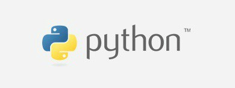

# 파이썬 기초

## 1. 파이썬의 개발환경

* 파이썬
  * 다른 프로그래밍 언어보다 문법이 간단하면서도 엄격하지않음
    * 예시: 변수에 별도의 타입 지정이 필요없음
  * 문법 표현이 매우 간결하여 프로그래밍 경험이 없어도 짧은 시간 내에 배울수있음
  * 같은작업에 대해서도 c나 자바로 작성할때보다 더간결함
* 특징
  * 객체 지향 프로그래밍 언어
    * 파이썬은 객체지향 언어이며 모든것이 객체로 구현되어 있음
    * 객체 (오브젝트): 숫자,문자,클래스 등 값을 가지고 있는 모든것
    * 객체 : 파이썬의 ~의것 , ~에 

## 2.파이썬의 기본용어

* 변수

  * 프로그래밍에서 말하고 싶은 변수(Variable)의 뜻은
    * **"값을 저장할 수 있는 저장공간"**

  * 컴퓨터 메로리 어딘가에 저장되어 있는 객체를 참조하기 위해 사용되는 이름
    * 객체 : 숫자 문자 클래스등
  * 변수는 할당 연산자(=)를 통해 값을 할당
  * type()
    * 변수에 할당된 값을 타입

* 식별자

  * 규칙
    * 식별자의 이름은 영문 알파벳 언더스코어 숫자로 구성
    * 첫글자에 숫자가 올수 없음
    * 길이제한이 없고 대소문자를 구별
  * 내장함수나 모듈 등의 이름으로도 만들면안된다.
  * input ()
    * 사용자로부터 값을 즉시 입력 받을수있는 내장함수
    * 대괄호 부분의 문자열을 넣으면 된다.

* bool형

  * true/false 참과 거짓 
  * 논리연산자 
    * 논리식을 판단하여 참과 거짓을 반환함
      * a and b = a와 b를 모두 true 이면 값은 true
      * a or b = a와 b모두 false 이면 값은 false
      * not = true를 false로, false를 true로 참과 거짓의 반대의결과

  

## 1. 코드 스타일 가이드

#### 코드 스타일 가드란?

> 소프트웨어 개발 시에 코딩 가이드를 준수하는 목적은 다수의 개발자들이 상호간의 소스코드에 대한 가독성 및 이해도를 높이고, 해당 표준에 따라 개발함으로써 프로젝트 품질의 일관성을 유지하여 프로젝트 완료 이후의 원활한 시스템 유지보수를 지원할 수 있도록 하는데 있다.

[PEP 8 – 파이썬 코드을 위한 스타일 가이드](https://peps.python.org/pep-0008/)

[Google에서 발제한 오픈 소스 프로젝트를 위한 스타일 가이드](https://google.github.io/styleguide/pyguide.html)

